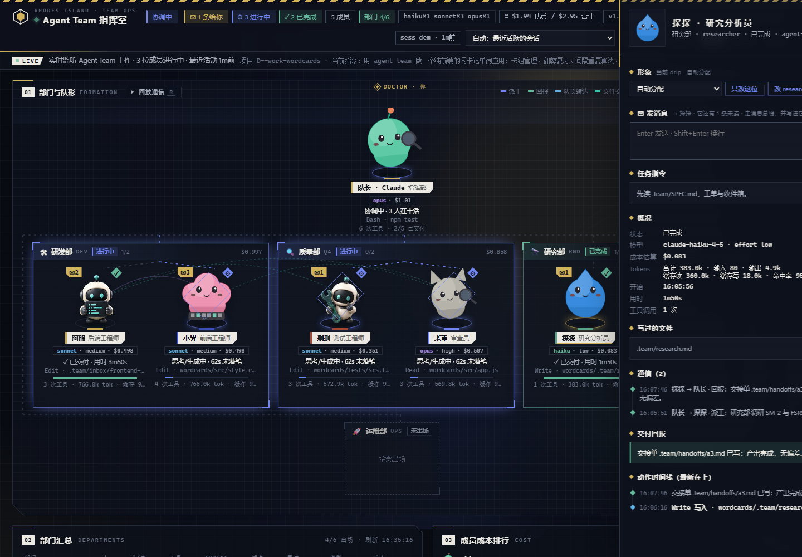
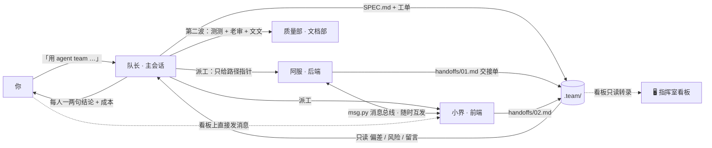

<div align="center">

# 🏢 claude-agent-team

**让 Claude Code 像一家小公司一样干活——而且你能看见它在干活。**

一支常驻的、分部门的 Agent 团队 · 一套成员之间的办公协议 · 一块浏览器里的实时指挥室看板

[](https://github.com/another-bbzj/claude-agent-team/actions/workflows/test.yml)


[快速开始](#-三分钟装好) · [它长什么样](#-它长什么样) · [怎么用](#-第一次使用完整走一遍) · [自定义团队](#-添加你自己的部门和成员) · [换形象](#-形象桌宠) · [第三方 API](#-第三方-api-用户) · [常见问题](#-常见问题) · [📖 图文手册](docs/GUIDE.md)

</div>

---


<div align="center"><sub>队长在上，各部门分组；每位成员一个会动的形象、名牌、模型档位、实时成本；飞线是派工 / 回报 / 留言 / 交接。</sub></div>

## ✨ 30 秒看懂

```
你：用 agent team 做一个记单词的网页应用

队长（主会话）：定规模 → 写 SPEC 契约 → 拆工单 → 在回复里给你看板链接 👉 [Agent Team 指挥室]
   ├─ 🛠 研发部   阿服 写数据层      小界 写界面        （并行，各自奔跑）
   ├─ 🔍 质量部   测测 写测试        老审 联调审查      （第二波）
   ├─ 📄 文档部   文文 写 README
   └─ 队长亲自跑测试、走流程、验收，向你汇报每个人的结论 + 本次花了多少钱
```

Claude Code 原生支持子代理，但派出去之后就是一个黑盒：谁在干什么、卡在哪、花了多少、成员之间有没有对上接口——你只能等最后一句"完成了"。这个项目把黑盒打开：

| | 没有它 | 有它 |
|---|---|---|
| 分工 | 每次临时描述一遍"你是后端、你是测试" | 8 位常驻成员各带名字、职责、模型档位，说「用 agent team」就自动上岗 |
| 协作 | 子代理之间没法私信，接口靠猜 | 消息总线 `msg.py` 让成员随时互发消息，工单 / 收件箱 / 交接单兜底；你也能在看板上直接给任何成员发话 |
| 可见性 | 看不到，等结果 | 明日方舟风格的实时指挥室：动画形象、当前工具、进度、token、成本、部门汇总、聊天式通讯频道、通信回放 |
| 成本 | 全用最强模型 | 按活分档（调研 haiku · 写代码 sonnet · 审查 opus），省 token 规则写进技能 |
| 形象 | — | 每人一只不重复的桌宠；Codex / petdex 的 4800+ 只随便导，正在工作的也能当场换 |

> **零依赖**：只需要 Python 3.8+ 标准库。看板只读你本机 `~/.claude/projects/` 里的转录文件，不调用任何 API、不联网（检查更新、下载形象除外，且都是你主动触发）。

---

## 🚀 三分钟装好

```bash
git clone https://github.com/another-bbzj/claude-agent-team.git
cd claude-agent-team
python install.py
```

然后**新开一个 Claude Code 会话**（任何项目文件夹都行）——看板已经在后台常驻：<http://127.0.0.1:7788/>

<details>
<summary><b>install.py 具体做了什么</b>（全部可用 <code>python install.py --uninstall</code> 撤销）</summary>

| 装到哪 | 内容 |
|---|---|
| `~/.claude/agents/` | 8 位常驻成员（Claude Code 原生 subagent 格式） |
| `~/.claude/skills/agent-team/` | 团队协议技能（步骤、部门表、办公目录规范、省 token 规则） |
| `~/.claude/team-board/` | 看板服务（单文件后端 + 单文件前端）、13 只自带形象、导入 / 下载 / 更新脚本 |
| `~/.claude/CLAUDE.md` | 追加一段全局约定（用标记包裹，不动你原有内容） |
| `~/.claude/settings.json` | 追加一个 SessionStart 钩子让看板随会话常驻（原文件先备份） |

可选参数：`--petdex` 顺便从 [petdex](https://petdex.dev) 下载 16 只挑好的桌宠；`--no-pets` 跳过本机 Codex 宠物导入。

</details>

<details>
<summary><b>以后怎么更新</b></summary>

看板顶栏出现 **「⬆ 有新版本 vX · 一键更新」** 就点它：自动下载 GitHub 最新版、重装、重启看板（每 12 小时自动检查一次）。命令行等价：

```bash
python ~/.claude/team-board/update.py                   # 只检查
python ~/.claude/team-board/update.py --apply --restart # 更新并重启看板
```

更新**不会丢你的东西**：`team.json` 里自建的部门 / 成员 / 形象 / 价格合并保留；你改过的成员 `.md` 和技能文件不覆盖（新版本另存为 `*.new` 供比较）；`sprites/` 里导入的形象一律不动。fork 了仓库就设 `TEAM_UPDATE_REPO=你/仓库名`。

</details>

---

## 👀 它长什么样


打开看板自上而下（每个面板、每个按钮的逐项说明见 **[docs/GUIDE.md](docs/GUIDE.md)**）：

| 区域 | 内容 |
|---|---|
| **顶栏** | 阶段（组队中 / 协调中 / 收尾完成）· 「✉ N 条给你」未读 · 进行中 / 已完成人数 · 部门出场情况 · 模型构成 · 估算成本 · 全队 token 与缓存命中率 · 版本 / 一键更新 · 会话切换 · ⚙ 外观 · 主题（自动 / 浅色 / 深色） |
| **01 部门与队形** | 顶部是「你」（DOCTOR），队长在下，各部门面板分组；每位成员：动画形象、名牌、`模型 · 强度 · 成本`、当前工具、进度条、用时、未读角标 ✉。飞线：派工 / 回报 / 队长转达 / 文件交接 / 成员私信 / 总线消息。「▶ 回放通信」（快捷键 `R`）回看本次全部交互 |
| **02 部门汇总** | 每个部门的人数、进行 / 完成 / 失败、工具次数、tokens、缓存命中、累计用时、模型、成本；下方是部门间对比条 |
| **03 成本排行** | 成员按估算成本排序，颜色区分 opus / sonnet / haiku |
| **04 通讯频道** | 聊天式时间线（你发的在右侧），按 全部 / 总线 / 派工·回报 / 私信·交接 / 与我相关 筛选；底部常驻输入框，选收件人（全员 / 队长 / 任一成员）后 Enter 发送、Shift+Enter 换行，快捷键 `/` 聚焦 |
| **05 任务卡片 · 06 动作流** | 每张工单的负责人与交付摘要 · 所有成员的工具调用时间线 |
| **ROSTER 常驻成员** | 所有成员定义；＋ 新建成员、⚙ 部门管理 |

点任何一位（含队长）打开**详情抽屉**：换形象、**✉ 直接给它发消息**、任务指令、模型与 token 明细（输入 / 输出 / 缓存读 / 缓存写 / 命中率）、写过的文件、通信记录、交付回报、完整动作时间线。



动画含义：读文件 / 搜索 = 审视 · 写代码 / 跑命令 = 奔跑 · 交付 = 跳跃 · 停滞 = 打瞌睡 zZ · 出错 = 倒地（卡片上写明原因：token 上限 / 用量上限 / 网络断开）。`Esc` 关闭抽屉和弹窗。

---

## 🧭 第一次使用：完整走一遍

**准备**：在 Claude Code 里打开任意项目文件夹（空文件夹也行）。

**1 · 下达任务。** 在对话里说：

> 用 agent team 做一个纯前端的闪卡记单词应用：卡组管理、翻牌复习、间隔重复算法、CSV 导入导出。

关键词「用 agent team」触发 `agent-team` 技能（「团队」「多代理」「分头做」「并行开发」也行）。队长第一件事是把看板打开并在回复里给你一个可点击的链接 **👉 Agent Team 指挥室**。

**2 · 队长定规模。**

- **S 级**（≤ 2 个文件）→ 不开团队，直接做，并告诉你原因。别为小事开会。
- **M 级**（3–6 个模块）→ 队长自己写契约、拆工单。
- **L 级**（> 6 个模块或陌生领域）→ 先派 `team-architect`（阿图）出契约和工单。

**3 · 建办公室。** 队长在项目里创建 `.team/`：

```
.team/
  SPEC.md           契约：目录结构、每个模块的导出签名、数据模型、DOM/class 约定、测试命令
  tickets/01-*.md   工单：一张一文件，写清 owner / 改哪些文件 / 依赖谁 / 验收标准
  inbox/<成员>.md    每位成员一个收件箱
  handoffs/         成员完成时写的交接单
```

**4 · 派工。** 没有依赖的工单同时派出（后台并行）。看板上：队长头顶飞出「派工」小球落到成员身上，成员开始奔跑，卡片显示它此刻在调用什么工具。

**5 · 成员交流。** 阿服写完数据层，`msg.py send frontend-dev "createStore(storage) 已导出"` 直接告诉小界（同时落进 `inbox/frontend-dev.md`）；小界在里程碑处 `msg.py inbox frontend-dev` 查收，有疑问当场回。看板上画成一条麦金色「总线消息」飞线，通讯频道里像聊天一样可读。你也可以随时在看板上插话，消息会送进对应成员的收件箱。

**6 · 收尾检查。** ≥ 2 人写了代码 → 派测测（测试）+ 老审（联调审查）；交付给人用 → 派文文（文档）。这是**建议不是硬门禁**：每个任务出场的部门本来就不同，用不到的部门不必凑人；空着的部门只显示「按需出场」，全员交付后质量部 / 文档部没来才用黄色提示「建议补位」。常驻成员里没有合适的人，队长直接派 `general-purpose`，标题写成「部门名·任务」，看板照样归进那个部门——需要的话还会先建一个新部门。1–3 人的小团队同样正常显示。

**7 · 验收汇报。** 队长**亲自**跑测试、走主流程，然后汇报：每个成员一两句结论、并行暴露的接缝问题、未修的隐患、本次成本（从看板读）。

整个过程你什么都不用操作，看着看板就行；想插手直接在对话里说（「让老审再看一遍 store.js」）。

---

## 🤝 团队是怎么协作的



团队像真实办公室一样协作（规则在 `skills/agent-team/office.md`）——即时的话走[消息总线](#-成员之间通信)，需要留档的走**文件**：

- **工单**是一条竖切片（穿过所需的每一层，单独可演示），大小能装进一个新上下文窗口；`files` 互不重叠，声明 `blocked_by`。
- **收件箱**追加式留言：接口签名、路径:行号、需要对方做的事。收件人开工第一步读它。
- **交接单** ≤ 25 行：改了什么、导出了什么、与契约的偏差、验证过什么、给谁留了言、遗留风险。
- **队长**只读交接单的三个字段（偏差 / 风险 / 留言），需要裁决的写进 `decisions.md`，阻塞解除的工单立即派出。

看板把这些动作画成飞线：总线消息 / SendMessage = 私信，写别人收件箱 = 留言，读别人写的文件 = 交接，派工指令里点名"某某已交付…" = 转达。

---

## 💬 成员之间通信

看板上的「通讯频道」COMMS 面板是聊天式时间线，汇聚成员的所有交流。通信优先级：

| 方式 | 用途 | 代码例 |
|---|---|---|
| ① **原生 SendMessage** | Claude Code 的 agent teams 环境里成员有这个工具时优先用；看板解析转录画出私信线 | `SendMessage(to="frontend-dev", message="…")` |
| ② **消息总线 msg.py** | 零依赖 CLI，任何能跑 Bash 的成员都能用；消息进看板、同时落进对方收件箱 | `python ~/.claude/team-board/msg.py send frontend-dev "接口已完成"` |
| ③ **.team/inbox 文件** | 兜底：看板没开时 msg.py 自动退化成直接追加收件箱文件 | 追加到 `.team/inbox/<subagent_type>.md` |

成员的系统提示词里已经写好约定：开工先 `msg.py inbox <自己>`，每个里程碑再查一次；队长在两波派工之间查收发给 `lead` 的消息（包括你在看板上发的）。

**msg.py 的四个命令**（装好后在 `~/.claude/team-board/msg.py`）：

```bash
MSG=~/.claude/team-board/msg.py
python $MSG send <to> "<text>" [--from <me>] [--reply <id>]   # 发消息；text 写 - 则从标准输入读（长文 / 含引号时用）
python $MSG inbox <me> [--peek] [--all]                       # 查收：默认只给未读并标记已读；--peek 只看；--all 全部历史
python $MSG who                                               # 当前会话：队长 + 各成员的显示名 / subagent_type / 状态 / 未读数
python $MSG log [-n 20]                                       # 本项目最近的消息
```

- `<to>` 和 `<me>` 支持多种形式：`subagent_type`（如 `backend-dev`）、成员显示名、`lead`（队长）、`user`（人类）、`all`（全员广播）。  
- `--from` 缺省取环境变量 `TEAM_AGENT_NAME`，再缺省 `unknown`；端口取 `TEAM_BOARD_PORT`（默认 7788）。  
- 消息按**项目**隔离：项目由当前目录决定（在 `.team/` 等子目录里运行也会向上找到所属项目），不同项目的团队互不串台。  
- 看板没在跑时，`send` 直接追加到最近的 `.team/inbox/<to>.md`，`inbox` 打印该文件。  
- 总线只接受本机请求；其他网页发来的跨站 POST 一律拒绝（防止网页借看板给你的代理注入指令）。

**在看板上的表现**：通讯频道里每条消息显示发送人头像、名字、类型、时间和正文，可按类型筛选；舞台上画麦金色飞线（发给「全员」的会给每个在场成员各飞一条）；成员卡显示未读角标；顶栏显示「✉ N 条给你」；收到发给「你」的消息、有新成员出场或成员交付时右下角弹出提示。

---

## 🎨 背景板 / 外观

看板背后可以铺你自己的图片，或者直接用 **Wallpaper Engine** 里的壁纸（视频壁纸会动），再调成半透明毛玻璃的效果。顶栏的 **◐ 透明度** 随手调背景和面板的透明度；点 **⚙ 外观** 打开完整的中文配置面板：


### 来源与使用

| 来源 | 说明 | 能做什么 |
|---|---|---|
| **Wallpaper Engine** | 自动找到本机所有 Steam 库里的创意工坊订阅与自建工程（找不到可设环境变量 `WALLPAPER_ENGINE_DIRS`）。**视频**壁纸直接播放原文件（不复制，可拖动进度）；**3D 场景**网页无法渲染，只能用预览图；**网页**壁纸带视频的按视频处理 | 带缩略图的网格 + 搜索，点一下即应用；标签页隐藏时视频自动暂停，系统开了「减少动态效果」也会暂停 |
| **当前桌面** | 读 Windows 当前桌面壁纸。Wallpaper Engine 会把正在用的壁纸（包括 3D 场景）存成一张全分辨率快照——想用某个 3D 场景的高清图，先在 WE 里设为桌面，再点这里 | 一键复制为背景（仅 Windows） |
| **上传 / 本机路径** | 任意 PNG / WebP / JPG（≤ 15 MB） | 拖入或浏览 |

### 尺寸与位置

配置面板提供 **三种 fit 模式**：

- **完整显示**（contain，默认）：整张图都能看到，不裁切。
- **铺满裁切**（cover）：填满区域，多出的部分裁掉。
- **自由摆放**（custom）：缩放 10–400%。

三种模式都能用 X / Y 滑块调位置，「范围」可选**整页**或**仅舞台**。最顺手的是右上角 **「⤢ 在页面上调整」**：直接在页面上**拖动**移动、**滚轮**缩放、**双击**复位，所见即所得，`Esc` 或「完成」退出。

### 透明化与效果

拖滑块时页面实时变化，停手约 0.3 秒后自动保存，刷新后保持：

| 参数 | 范围 | 效果 |
|---|---|---|
| 透明度 | 0–100% | 背景整体透明度（顶栏 ◐ 也能调） |
| 模糊 | 0–20 px | 背景高斯模糊 |
| 饱和度 | 0–200% | 0 = 黑白，200% = 更鲜艳 |
| 遮罩 | fade-left / fade-right / fade-bottom / vignette / none | 边界渐隐效果 |
| 混合 | normal / luminosity / screen / multiply / soft-light | 图层混合模式 |
| 面板 | 20–100% | 数据面板的不透明度：调低后面板变成毛玻璃，壁纸透出更多（顶栏 ◐ 也能调） |
| 压暗 | 0–90% | 叠一层黑（深色主题）/ 白（浅色主题），让花哨的壁纸不抢内容 |

### 版权说明

- Wallpaper Engine 壁纸版权归各创意工坊作者；你上传的图片归你自己。
- 仓库**不附带任何图片或壁纸**：上传 / 复制的图只存在你本机的 `~/.claude/team-board/backdrops/`（gitignore，`install.py` 更新时不覆盖也不外传）；WE 视频壁纸直接从 Steam 目录读取，不复制；仅供你个人看板装饰。窄屏下背景板自动变淡。

---

## 👥 内置成员与模型分级

| 部门 | 成员 | `subagent_type` | 模型 · 强度 | 何时出场 |
|---|---|---|---|---|
| 🎯 指挥部 | 阿图·架构师 | `team-architect` | opus · high | L 级任务：出契约与工单 |
| 🛠 研发部 | 阿服·后端 / 小界·前端 | `backend-dev` / `frontend-dev` | sonnet · medium | 任何写代码的任务 |
| 🔍 质量部 | 测测·测试 / 老审·审查联调 | `qa-tester` / `code-reviewer` | sonnet · medium / opus · high | ≥ 2 人写了代码时建议收尾派 |
| 🔭 研究部 | 探探·研究分析 | `researcher` | haiku · low | 调研、读外部代码、查文档 |
| 📄 文档部 | 文文·文档 | `docs-writer` | haiku · low | 交付给人用时 |
| 🚀 运维部 | 发发·发布 | `release-ops` | sonnet · low | 构建、打包、CI、部署脚本 |

**为什么不全用最强模型**：调研和写文档用 haiku 便宜 10 倍以上；写代码 sonnet 够用；只有架构拆解和联调审查这种需要深度推理的活才上 opus。每个成员的档位写在它的 `.md` 里，改一行就换档；派工时也可以临时覆盖。

不开团队也能直接点名：「让 code-reviewer 看看我刚改的这几个文件」——Claude 按 `description` 自动委派。

---

## 🧩 添加你自己的部门和成员

内置成员只覆盖通用软件开发。你的领域（嵌入式、数据科学、游戏、法务……）这样加：


**加部门**：ROSTER 面板 → **⚙ 部门管理** → ＋ 新增部门。填 id（如 `embedded`）、名称、图标、出场规则（`optional` 可选 · `code` 有人写代码就建议 · `code2` ≥ 2 人写代码才建议 · `deliver` 交付给人用时建议 · `always` 总是）。


**加成员**：**＋ 新建成员**，表单顶部实时预览：

- **标识**（`subagent_type`）、显示名、岗位、部门、颜色、**形象**（可当场导入桌宠文件）
- **模型**：`sonnet / opus / haiku / fable / inherit`，或直接输入第三方模型 id；**思考强度** `low → max`
- **简介**：写清"什么时候该用它"——Claude 靠这句自动委派，越具体越准
- **预载技能**：`~/.claude/skills/` 里的技能名（把你领域的 SKILL.md 挂上去，成员开工时自动带着）
- **系统提示词**：工作方法、硬性规范、验证方式

保存即写入 `~/.claude/agents/<标识>.md`（Claude Code 原生格式，**新开的会话**才会加载）。再次编辑不会丢 `.md` 里表单没有的字段（`tools` / `permissionMode` / `maxTurns` 等原样保留）。也可以直接手写：

```markdown
---
name: firmware-dev
description: 固件工程师（嵌入式部）。写或改 MCU 固件、外设驱动、中断与主循环划分时使用。
model: sonnet
effort: medium
memory: user
skills:
  - my-mcu-skill
---
你是嵌入式部的固件工程师。开工先读 .team/SPEC.md、自己的工单和收件箱……
```

---

## 🐾 形象（桌宠）

仓库自带 **13 只**（4 只来自 [cc-haha](https://github.com/NanmiCoder/cc-haha)，9 只由 `make_pets.py` 程序化绘制，均 MIT），每个岗位各占一只，开箱不重复。真正好玩的是：看板与 Codex 桌宠、[petdex](https://petdex.dev) 画廊（**4800+ 只**社区形象）用的是**同一种雪碧图格式**（8 列 × 9 或 11 行，每帧 192×208，webp / png，通常打包成 `pet.json + spritesheet.webp` 的 zip），所以：

| 想要 | 怎么做 |
|---|---|
| 给正在工作的成员换个形象 | 点它 → 抽屉顶部「形象」→ 选一个 → **只改这位** / **改 xxx 角色**（以后都用）/ **导入…**（直接用桌宠文件）。舞台立刻换，队长也能换 |
| 建成员时选 / 导入形象 | 成员表单 → 形象旁 **「导入形象…」**：把 zip / webp / png **拖进去**或选择文件（解压出来的 `pet.json + spritesheet.webp` 一起多选，名字自动带上），或者直接**填本机路径**（下载下来的文件夹 / zip / 图片都行）。显示名随便起，中文也行；标识留空自动生成。预览立刻换；「删」删除导入的形象 |
| 从 petdex 批量拿 | `python ~/.claude/team-board/fetch_petdex.py --starter`（16 只挑好的）· `fetch_petdex.py boba glitchcat` · `fetch_petdex.py --list --search cat` |
| 用自己电脑上已有的 | `python ~/.claude/team-board/import_codex_pets.py`：自动导入本机 Codex 内置 9 只、`~/.codex/pets/`（Codex 里创建 / 领养的）、`~/.petdex/pets/`；也可直接传 zip / 目录 / 雪碧图路径 |

导入的形象放在 `~/.claude/team-board/sprites/<id>.webp|png`，旁边 `<id>.json` 记录名字、简介、**作者与来源**（下拉里悬停可见）。

**主体自动适配**：自制 / 下载的形象常常主体偏小，或各动作大小不一（idle 坐着很小、跑起来很大、某几帧被生成器裁到格底）。看板会**识别每个动作的主体**（不透明像素的质量与包围盒），行间按 `sqrt(最大质量 / 本行质量)` 归一、整体偏小再全局放大，播放到哪个动作就用哪个倍率——在屏幕上放大，不裁切，翅膀再宽也不会被格子切掉；刻意画小的姿势（趴下、缩成一团）质量不变，不会被硬拉高。想把放大写进图片本身：成员表单 → 形象旁 **「适配主体」**，或 `python ~/.claude/team-board/fit_pet.py <id>`（需要 `pip install pillow`；格子里放得下的部分直接改图并留 `.orig` 备份，放不下的写进 `<id>.json` 的 `fitRows`；`--restore <id>` 还原；`--fix-cropped` 用 idle 帧顶替被裁掉身体的动作）。导入 / 上传时会自动跑一次。

> **为什么仓库不直接附带这些形象**：Codex 内置的 9 只版权归 OpenAI；petdex 上的形象由各自作者上传、没有统一授权（很多是二创），标注出处并不等于获得再分发许可。所以脚本只把它们下载到**你自己的电脑**并记下作者——既能用上成千上万的形象，又不侵犯作者权利。

---

## 🔌 第三方 API 用户

不是 Claude 账号登录、而是通过 `ANTHROPIC_BASE_URL` 转发到 DeepSeek / GLM / Kimi / Qwen / OpenAI / Gemini / Grok 等？完全支持，四处都适配了：

1. **识别**：转录里的模型 id（`deepseek-chat`、`glm-4.6`、`openai/gpt-5`…）原样识别，provider 前缀自动忽略，按家族汇总；
2. **计数**：没有 message id、只有 requestId 的回复同样正确去重；没有缓存字段按 0 计；
3. **成员**：成员定义的模型框直接输入第三方 id，派工就按它请求（`opus / sonnet` 这类别名在第三方网关下取决于网关怎么映射，想指定就写完整 id）；
4. **成本**：内置 50+ 行公开标价（Claude · DeepSeek · OpenAI · Gemini · Qwen · GLM · Kimi · MiniMax · Grok · Llama · Mistral），按模型 id **最长前缀匹配**，认不出具体版本退到家族默认行，完全不认识的显示「未定价」并在顶栏提示，不瞎算。价格会变，改 `team-board/team.json` 即刻生效：

```json
"deepseek-chat": { "in": 0.30, "out": 1.20, "cache_read": 0.006, "cache_write": 0.30 }
```

（USD / 百万 token；DeepSeek 为标准时段价；OpenAI / DeepSeek / Qwen 等没有单独的缓存写入费，`cache_write` 按输入价计。）

---

## 💸 省 token 的规则

写在 `skills/agent-team/lean.md`，成员和队长都遵守：

- **队长窗口最贵**：派工只给路径指针（契约、工单、收件箱），不粘内容；成员汇报 ≤ 200 字；队长只读交接单的三个字段。
- **成员不通读全库**：按工单 `files` 定向 grep。
- **写代码用"懒惰资深"阶梯**：需要存在吗 → 库里已有？→ 标准库？→ 平台原生？→ 已装依赖？→ 能一行？→ 才写最少的新代码。不做单实现的接口、永不变化的配置、"以后用"的脚手架。
- **结算**：验收时看板 `totals` 给出成员成本与模型构成；某个成员成本明显高于同档同事，查它的交接单，通常是通读全库或反复重试。

token 口径与独立工具 [ccusage](https://github.com/ryoppippi/ccusage) 对同一会话的统计一致（误差 < 1%）——看板按 message id / requestId 去重，只取每条消息最后一份 usage 快照。

---

## 🧪 自检与测试

```bash
python -m unittest discover -s tests -v
```

76 个测试，只用标准库，几秒跑完：合成的 Claude Code 转录全流程解析（成员状态 / 模型 / token 去重 / 定价 / 派工 / 回报 / 留言 / 交接 / 转达 / 部门出场与收尾建议 / 小团队 / 临时成员归部门）、成员与部门增删改（编辑不丢字段）、形象导入（webp / png / zip / 缩放 / 坏尺寸 / 删除保护）、消息总线 msg.py（收件箱写入 / 查收 / 解析）、背景板 v2（Wallpaper Engine 库扫描 / 预览提取 / Range 206 分块流 / 桌面壁纸 / v2 字段与兼容）、第三方 API 转录、HTTP 接口、导入与更新脚本、`install.py` 安装 / 更新不丢用户改动 / 卸载。GitHub Actions 在 Windows / macOS / Linux × Python 3.8 / 3.12 上自动跑。

---

## ❓ 常见问题

**Q：`git pull && python install.py` 之后，导入形象提示 `not found` / 顶栏没有版本号和「检查更新」/ 文件夹里的形象没出现？**
之前启动的看板进程还在跑旧代码（页面已经是新的，服务还是旧的）。1.3.2 起：`install.py` 装完会自动重启看板；`ensure.py`（SessionStart 钩子）每次都会比对在跑的服务版本和本机 `VERSION`，不一致就自动换掉——所以以后不会再遇到。现在手动跑一次 `python ~/.claude/team-board/ensure.py --restart` 即可。顶栏常驻 `v1.x.x` 版本号和「检查更新」按钮，有新版本会变成「⬆ 一键更新」。

**Q：导入形象没反应 / 起了个中文名说「标识只能用小写字母」/ 下载下来的 zip 没有 .zip 后缀选不到？**
1.3.3 起这些都不会再挡住你：导入走一个专门的对话框（不再靠浏览器的 `prompt` 弹窗——嵌入式浏览器里它弹不出来，之前抽屉里导入出错也没地方显示），成功 / 失败都写在对话框里；中文名记成显示名、标识自动从文件名或 `pet.json` 推，推不出就 `pet-1`；文件按内容识别不看后缀；还可以直接填本机路径（比如 `C:\Users\你\Downloads\zip`），看板自己去读。

**Q：我把桌宠文件直接放进 `sprites/`（或 `~/.codex/pets/`、`~/.petdex/pets/`）了，怎么让看板认到？**
不用做什么：服务启动时和每次打开成员表单 / 形象列表时会自动扫描——大写、下划线、`xxx-spritesheet.webp` 这类文件名会复制成合法 id（`My_Cat-spritesheet.webp` → `my-cat`），`pet.json + spritesheet.webp` 的目录会连名字、作者一起纳入。


<details><summary><b>看板打不开 / 页面空白</b></summary>

新开一个会话让钩子触发，或手动 `python ~/.claude/team-board/ensure.py --open`。端口被占用可改 `TEAM_BOARD_PORT` 环境变量。
</details>

<details><summary><b>说了「用 agent team」但看板没自动弹出来（常见于 macOS / 纯 CLI）</b></summary>

钩子只负责让服务在后台常驻，弹窗由技能在派工前执行 `ensure.py --open` 完成（系统默认浏览器），同时队长会在回复里给出可点击的 **Agent Team 指挥室** 链接。如果它忘了，直接说「打开看板」，或自己开 <http://127.0.0.1:7788/> ——服务一直在。
</details>

<details><summary><b>看板显示"还没有会话派出过子代理"</b></summary>

正常——你还没派过团队。派一次后自动出现；右上角下拉可切换到任何历史会话回看。
</details>

<details><summary><b>新建的成员派不出去</b></summary>

成员在会话启动时加载，新开一个会话即可。临时要用，让队长派 `general-purpose` 并把标题写成「部门名·任务」。
</details>

<details><summary><b>Claude 没开团队、自己做了</b></summary>

它判断为 S 级（≤ 2 个文件）。明确说「就用团队做」它会照办。
</details>

<details><summary><b>某个部门没人出场，看板会报错吗</b></summary>

不会。进行中一律显示「按需出场」；全员交付后，只有 ≥ 2 人写了代码却没有质量部、或交付给人用却没有文档部时，才用黄色提示「建议补位」。
</details>

<details><summary><b>压缩了上下文（/compact）之后看板数据会丢吗</b></summary>

不会。看板读的是转录文件，压缩只影响模型看到的上下文，文件里的历史都在；成员、通信、token 统计照常。
</details>

<details><summary><b>子代理之间怎么通信（我听说子代理没有私信工具）</b></summary>

原生 `SendMessage` 能用最好，但不是所有环境都支持。备选方案：
1. 成员在 `.team/inbox/` 里写留言（队长负责转达）。
2. **用 `msg.py` 零依赖 CLI 走消息总线（推荐）**：`python ~/.claude/team-board/msg.py send backend-dev "数据库已完成"`，任何能跑 Bash 的环境都行。
3. 看板上的「通讯频道」汇聚这些消息，你也能在那里直接回复。详见 [💬 成员之间通信](#-成员之间通信)。
</details>

<details><summary><b>Wallpaper Engine 页签是空的 / 3D 场景壁纸很糊</b></summary>

- 空的：看板没找到 Steam 库。把壁纸目录（`…/steamapps/workshop/content/431960` 或其所在的 Steam 库）写进环境变量 `WALLPAPER_ENGINE_DIRS`（多个用 `;` 分隔），重启看板。
- 糊：3D 场景（scene）是 WE 的私有格式，网页只能拿到预览图。先在 Wallpaper Engine 里把它设为桌面，再在外观面板用「当前桌面」拿全分辨率快照。视频壁纸不受影响。
</details>

<details><summary><b>卸载会删掉什么</b></summary>

`python install.py --uninstall` 删除 `~/.claude/team-board/` 整个目录——包括消息总线记录 `bus/` 和背景图 `backdrops/`；`settings.json` 与 `CLAUDE.md` 只移除本工具加入的部分。更新（重装）不会动这两个目录。
</details>

<details><summary><b>token / 成本数字和服务商后台对不上</b></summary>

- 看板的「合计」= 输入 + 输出 + 缓存读 + 缓存写，其中缓存读通常占 90% 以上；服务商后台可能只显示输入 + 输出——对比时看同一口径。
- 成本按 `team-board/team.json` 的公开单价估算，不是账单。
</details>

<details><summary><b>换电脑</b></summary>

把仓库 clone 过去再 `python install.py`；钩子路径按新机器自动生成。
</details>

---

## 🗂 目录结构

```
team-board/        看板及后端服务
  team_board.py              HTTP 服务（标准库）· 转录解析 · 消息总线 / 背景板 API
  msg.py                     零依赖 CLI：send / inbox / who / log（成员通信）
  backdrop_store.py          背景板图片与配置的本地存储
  wallpapers.py              扫描 Steam 库 Wallpaper Engine 壁纸、当前桌面快照
  index.html                 单文件前端（明日方舟风格 UI）
  team.json                  部门 / 成员登记 / 形象 / 价格
  ensure.py / update.py      钩子入口 / 检查更新
  import_codex_pets.py       导入本机 Codex / petdex 宠物或任意桌宠文件
  fit_pet.py                 识别主体并自动适配大小
  fetch_petdex.py            从 petdex 下载形象
  make_pets.py               程序化绘制自带形象
  bus/                       消息总线数据（gitignore）
  backdrops/                 背景图与背景板配置（gitignore）
  sprites/                   形象（仓库只带 13 只自带的；导入的留在本机）
agents/            8 位常驻成员定义（Claude Code 原生 subagent 格式）
skills/agent-team/ 团队协议：SKILL.md 步骤 · roles.md 部门与模型档位 · office.md 办公目录规范 · lean.md 省 token 规则
docs/              图文操作手册 GUIDE.md 与截图
tests/             自动化测试（msg.py / 消息总线 / 背景板 API / Wallpaper Engine 壁纸）
tools/             发布工具（dist-hashes.json 生成）
CLAUDE.global.md   写入 ~/.claude/CLAUDE.md 的全局约定
install.py         安装 / 更新 / 卸载        VERSION  版本号
```

## 🙏 致谢

思路借鉴 [cc-haha](https://github.com/NanmiCoder/cc-haha) 的 Agent Teams 工作台；token 规则借鉴 [ponytail](https://github.com/DietrichGebert/ponytail) 与 [mattpocock/skills](https://github.com/mattpocock/skills)；桌宠格式与 Codex、[petdex](https://petdex.dev) 兼容，感谢社区作者们的形象。

## 📄 License

MIT © [another-bbzj](https://github.com/another-bbzj)
