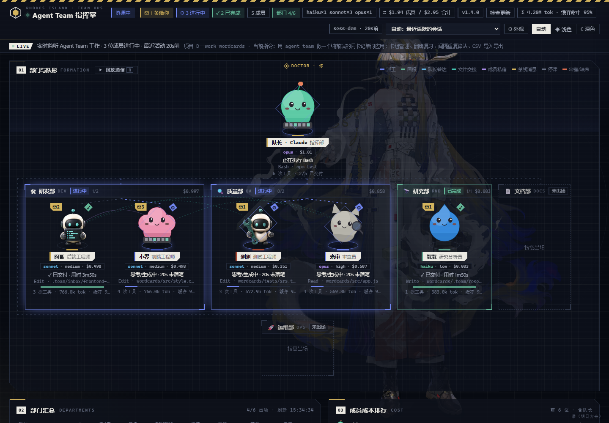
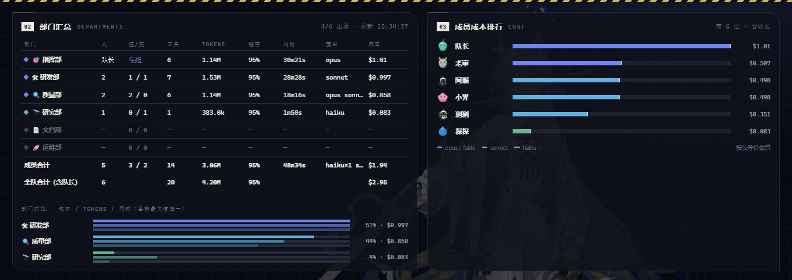
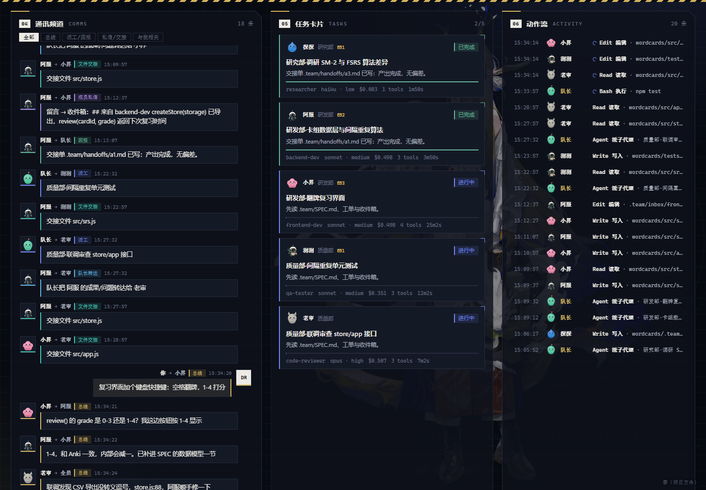
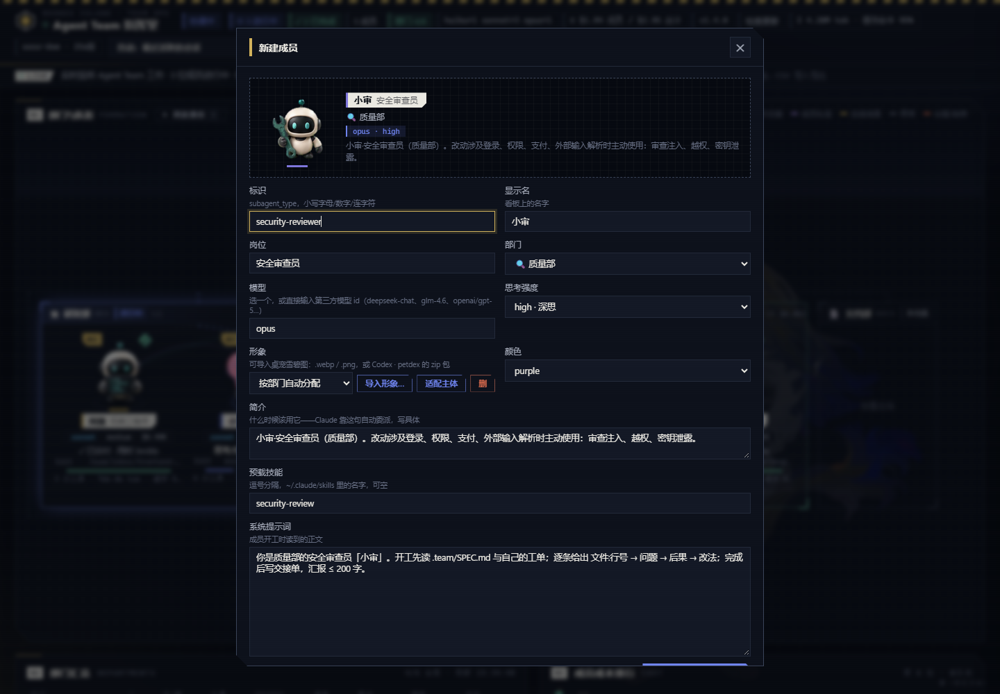
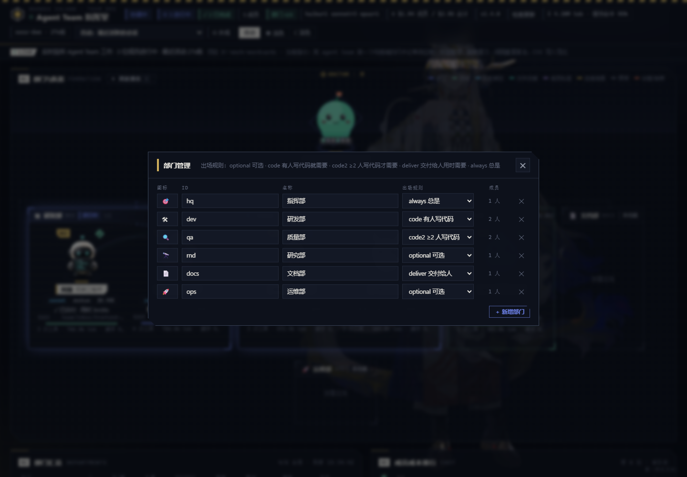
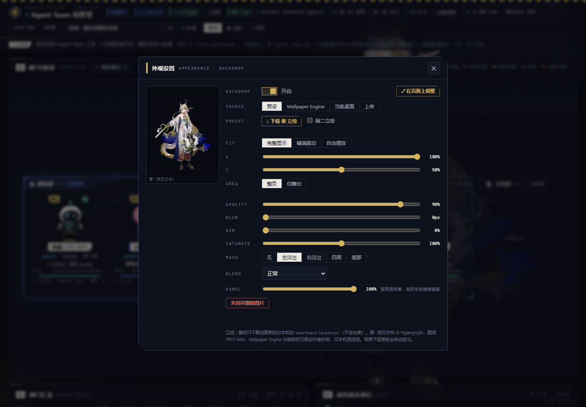

# 图文操作手册

看板地址：http://127.0.0.1:7788/ （由 SessionStart 钩子随 Claude Code 会话自动常驻；手动启动 `python ~/.claude/team-board/ensure.py`）。

---

## 1. 整体界面



从上到下：

| 位置 | 说明 |
|---|---|
| **顶栏** | 阶段（组队中 / 协调中 / 收尾完成）· `⚙ N 进行中` · `✓ N 已完成` · 成员数 · **部门 x/y**（收尾后若建议出场的部门没来，变黄提示「建议补位」，不是错误）· 模型构成（`opus×10 haiku×5`）· 估算成本（成员 / 含队长合计）· 全队 token 与缓存命中率 · 会话 id 与最近活动 |
| **第二行** | 会话选择（默认"自动：最近活跃的会话"，可切到任何历史会话回看）· 主题（自动 / 浅色 / 深色） |
| **LIVE 条** | 实时监听状态：几位成员进行中 / 暂无活动；项目名；当前指令 |
| **FORMATION 舞台** | 队长在顶部；每个部门一个虚线面板（名称、状态、人数、部门成本）；成员站在自己部门里。右上角图例是飞线颜色：派工 / 回报 / 队长转达 / 文件交接 / 成员私信 / 停滞 / 出错。`▶ 回放通信` 把本次会话的全部交互重新播一遍 |

每位成员的卡片：动画形象 · 名牌（名字 · 岗位）· `模型 · 成本` 胶囊 · 状态行（正在用什么工具 / 已交付·用时 / zZ 停滞 / ✕ 出错）· 当前工具调用 · 进度条 · `工具次数 · tokens · 缓存命中`。

动画：读文件/搜索 = 审视姿势；写代码/跑命令 = 奔跑；交付 = 跳跃庆祝；停滞 = 打瞌睡；出错 = 倒地；被派工/收到回报 = 挥手 + 头顶气泡。

**点击任何成员**打开右侧详情抽屉：任务指令、模型与强度、成本、token 明细（输入 / 输出 / 缓存读 / 缓存写 / 命中率）、写过的文件、通信记录、交付回报全文、动作时间线。

---

## 2. 部门汇总与成本排行



**左：部门汇总表**——每个部门的人数、进行/完成/失败、工具调用次数、tokens、缓存命中率、累计用时、用到的模型、估算成本。第一行**指挥部就是队长本人**（主会话）：在线/待命、它自己的工具调用数、token、缓存命中、会话时长、模型、成本；底部两行合计：成员合计、全队合计（含队长）。标题右侧的「刷新 HH:MM:SS」每 1.5 秒跳动，所有数字都是实时的。灰色行 = 本次没出场的部门；黄色 `建议补位` = 收尾后建议出场但没来（不是错误）。表下方是部门对比条（成本 / tokens / 用时各按最大值归一）。

**右：成员成本排行**——队长和成员一起按估算成本排序（队长通常排第一：主会话承载了你与它的全部对话），条的颜色区分模型档位（橙 opus/fable、蓝 sonnet、绿 haiku）。悬停显示 token 与缓存命中。

> 成本按 `team-board/team.json` 里的公开单价估算（输入 / 输出 / 缓存读 / 缓存写分开计），不是账单。改单价：编辑 `pricing_usd_per_mtok`，页面即时生效。

---

## 3. 任务、通信、动作、成员名单



| 面板 | 内容 |
|---|---|
| **TASKS 任务卡片** | 每位成员一张：形象、名字、部门、状态、任务标题（就是派工时的 description）、交付摘要或指令摘要、`agentType · 模型 · 成本 · 工具数 · 用时`。点击打开详情 |
| **COMMS 通信流** | 派工 / 回报 / 私信 / 交接 / 转达 / 消息总线。过滤器：全部、总线（msg.py）、派工/回报、私信/交接、与我相关。直接在下方发送框给队长 / 成员 / 全员发消息（Enter 发送，Shift+Enter 换行，/ 聚焦）；消息写进 `.team/inbox/` 并在看板显示 |
| **ACTIVITY 动作流** | 所有成员（含队长）的工具调用时间线：时间、谁、`工具 · 参数摘要`；未完成的带旋转圈，出错的红色 |
| **ROSTER 常驻成员** | `~/.claude/agents/` 里的全部成员定义：形象、显示名、标识、部门·岗位、`模型 · 强度`；正在会话里出场的高亮；★ 标记自定义成员。右上角 `＋ 新建成员`、`⚙ 部门管理` |

三个面板等高，各自内部滚动。

**成员详情抽屉**：点舞台上任何一位、任务卡片或名单里的成员打开。最上面是**形象**区——下拉选一个形象后：`只改这位`（只影响这个会话里的这一位，记在 `team.json` 的 `member_pets`）、`改 <subagent_type> 角色`（写进常驻定义，以后每次都用；临时派的 general-purpose 没有这个按钮）、`导入…`（选 zip / webp / png 桌宠文件，导入后直接用在它身上）。队长也能换（`换队长形象`）。改完舞台立刻换图，不用刷新。往下是任务指令、概况（模型 · 成本 · token）、写过的文件、通信、交付回报、动作时间线。

---

## 4. 新建 / 编辑 / 删除成员



**入口**：ROSTER 面板 → `＋ 新建成员`；点任意成员卡片 = 编辑；悬停卡片右侧 `✕` = 删除（编辑弹窗里也有删除按钮）。

**表单顶部是实时预览**：形象、名牌颜色、部门、模型档位、简介——改一项立刻变。

形象旁的 **「适配主体」**：识别雪碧图里的角色主体，把偏小的放大、各动作大小拉齐（被裁到格底的动作不放大，会提示无法补全）。不点也没关系——看板显示时本来就会按主体自动放大；这个按钮只是把放大写进图片本身（留 `.orig` 备份，需要 Pillow）。

| 字段 | 填什么 |
|---|---|
| 标识 | `subagent_type`，小写字母 / 数字 / 连字符，如 `security-reviewer`。派工时用它点名 |
| 显示名 / 岗位 | 看板上的名字和头衔，如 `小审` / `安全审查员` |
| 部门 | 从部门管理里定义的部门中选 |
| 模型 | 选 `sonnet` / `opus` / `haiku` / `fable` / `inherit`（跟随主会话），或直接输入第三方模型 id（`deepseek-chat`、`glm-4.6`、`openai/gpt-5`…，第三方 API 用户用这个） |
| 思考强度 | 留空 = 跟随会话；`low` / `medium` / `high` / `xhigh` / `max` |
| 形象 | 下拉选一个（分「导入的形象」「仓库自带」两组，悬停显示作者）；旁边 **「导入形象…」** 可直接选 zip / webp / png 桌宠文件导入，**「删」** 删除选中的导入形象；"按部门自动分配"则按部门默认 |
| 颜色 | Claude Code 任务列表里的颜色，也用作看板名牌边框 |
| 简介 | **最重要的一格**：写清"什么时候该用它"。Claude 靠这句自动委派，越具体越准 |
| 预载技能 | `~/.claude/skills/` 里的技能名，逗号分隔；成员开工时自动带着 |
| 系统提示词 | 成员的工作方法、硬性规范、验证方式、交付格式 |

**保存**后写入 `~/.claude/agents/<标识>.md`（Claude Code 原生 subagent 格式），部门/形象登记到 `team-board/team.json`。**新开的会话**才会加载新成员（会话启动时读取 agents 目录）。

生成的文件长这样，也可以直接手写：

```markdown
---
name: security-reviewer
description: 小审·安全审查员（质量部）。改动涉及登录、权限、支付、外部输入解析时主动使用：审查注入、越权、密钥泄露。
model: opus
effort: high
memory: user
color: purple
skills:
  - security-review
---
你是质量部的安全审查员「小审」。开工先读 .team/SPEC.md 与自己的工单；逐条给出 文件:行号 → 问题 → 后果 → 改法；完成后写交接单，汇报 ≤ 200 字。
```

---

## 5. 部门管理



**入口**：ROSTER 面板 → `⚙ 部门管理`。

每行：图标（emoji）· id（小写，创建后不可改）· 名称 · 出场规则 · 当前成员数 · `✕` 删除。改任一格自动保存；`＋ 新增部门` 在底部加一行，填完 id 和名称回车即保存。

**出场规则**决定收尾后什么时候把这个部门标为「建议补位」（只在全员交付后提示，进行中一律显示「按需出场」，不算错误）：

| 规则 | 含义 | 内置用法 |
|---|---|---|
| `optional` | 可选，从不提示 | 研究部、运维部 |
| `code` | 只要有人写代码就需要 | 研发部 |
| `code2` | ≥ 2 人写了代码才需要 | 质量部（测试 + 审查） |
| `deliver` | 交付给人用时需要 | 文档部 |
| `always` | 总是需要 | 指挥部 |

保护：指挥部不能删（队长在里面）；部门里还有成员时拒绝删除，并列出是谁——先把成员改到别的部门或删掉。

---

## 6. 会话切换与回放

- 顶栏下拉默认跟随**最近活跃的会话**；列表里是所有派出过子代理的会话（项目 · 会话 id · 人数 · 最近活动），选一个即可回看当时的团队。
- `▶ 回放通信`：把当前会话的派工 / 回报 / 私信 / 交接 / 转达按顺序重新飞一遍，看清楚信息是怎么流动的。
- 主题：`自动` 跟随系统，`浅色` / `深色` 固定；选择记在浏览器里。

---

## 7. 外观面板（背景板 v2）



点顶栏的 **⚙ 外观** 打开面板。

### 来源页签

| 页签 | 用途 |
|---|---|
| **预设** | 仓库自带立绘；目前有黍（下载后存入 `team-board/backdrops/`）；点击直接使用 |
| **Wallpaper Engine** | 列出你所有 Steam 库里订阅 / 自建的 WE 壁纸（视频、3D 场景、网页三类）；缩略图网格显示，标题+类型角标；搜索框实时过滤 |
| **当前桌面** | Windows 专用；读当前桌面壁纸（适合 WE 的 3D 场景：在 WE 里设为桌面后再点这里，得到高清截图）；非 Windows 自动隐藏 |
| **上传** | 选本机图片（png / webp / jpg，≤ 15 MB）或输入本地路径（如 `C:\Users\你\Pictures\shu.png`）；拖进面板也行 |

### 调整参数

| 参数 | 说明 | 备注 |
|---|---|---|
| **Fit** | 完整显示（contain）/ 铺满裁切（cover）/ 自由摆放（custom） | 自由摆放时显示 Scale 滑块 |
| **Scale** | 缩放百分比（10–400%） | 仅自由摆放时可用；拖动 / 滚轮快速调整 |
| **X, Y** | 水平 / 竖直位置（0–100%） | 中点位置，拖动移动 |
| **Area** | 整页 / 仅舞台 | 仅舞台：背景板只显示在舞台区域，跟随舞台缩放和滚动 |
| **Opacity** | 透明度（0.1–1）| 整体透明度 |
| **Blur** | 模糊（0–20px） | CSS 高斯模糊 |
| **Dim** | 变暗（0–90%） | 覆盖一层暗色 |
| **Saturate** | 饱和度（0–200%） | 彩色 / 灰度 / 超饱和 |
| **Mask** | 边缘渐隐：无/左淡出/右淡出/四周/底部 | 与通讯、成员卡片融合 |
| **Blend** | 混合模式：正常/luminosity/screen/multiply/soft-light | CSS mix-blend-mode |
| **Panel** | 面板透明度（30–100%） | 越低毛玻璃感越强；自动给面板加 backdrop-filter blur |

### 在页面上调整

点 **⤢ 在页面上调整**，进入交互模式：
- **拖动**：移动背景板（改 X/Y）
- **滚轮**：缩放（仅自由摆放；改 Scale）
- **双击**：复位到默认值
- **Esc 或再点按钮**：退出调整

底部提示条实时显示当前 X/Y/Scale。

---

## 8. 形象素材

- 仓库自带 13 只：4 只机器人（cc-haha，MIT）+ 9 只程序化绘制的角色（`make_pets.py`，MIT）。开箱每个岗位一只，不重复。改配色 / 形状 / 特征：编辑 `make_pets.py` 里的 `CHARS`，`python make_pets.py` 重新生成。
- 可选，装了 Codex 桌面版的机器：`python ~/.claude/team-board/import_codex_pets.py` 从你本机安装文件里提取 9 只 Codex 宠物，并顺带导入 `~/.codex/pets/`（Codex 里创建 / 领养的）与 `~/.petdex/pets/` 里的桌宠（`install.py` 会自动尝试）。素材归各自作者，只留本机。
- 从 petdex 画廊下载：`python ~/.claude/team-board/fetch_petdex.py --starter`（16 只）；`--list --search 关键词` 搜；按 slug 点名下载。作者与来源写进 `sprites/<id>.json`。
- 看板里导入：成员编辑框 → 形象旁「导入形象…」→ 选 zip（pet.json + spritesheet）、.webp 或 .png。格式：8 列、每帧 192:208、9 行或 11 行（1536×1872 / 1536×2288，等比缩放也行）。行序：idle / 跑右 / 跑左 / 挥手 / 跳 / 失败 / 等待 / 工作 / 审阅。
- 手动放：把雪碧图直接丢进 `team-board/sprites/`，刷新页面即可选到。

每位出场成员独占一只不重复的形象：本岗位专属 → 同类别备选 → 任意空闲 → 全占满才换色。

---

## 9. 命令行与接口

```bash
python ~/.claude/team-board/ensure.py                 # 没在运行就后台启动（钩子用的就是它）
python ~/.claude/team-board/team_board.py --port 7788 # 前台运行，Ctrl+C 退出
python ~/.claude/team-board/team_board.py --dump      # 打印一次快照 JSON 后退出
python ~/.claude/team-board/team_board.py --session <会话id前缀>   # 固定观察某个会话
python ~/.claude/team-board/update.py                 # 检查更新；--apply --restart 一键更新并重启看板
```

| 接口 | 用途 |
|---|---|
| `GET /snapshot.json` | 看板数据（成员、部门、通信、动作、totals） |
| `GET /api/agents` | 成员定义列表 + 部门 / 模型 / 强度 / 形象选项 |
| `POST /api/agents` | 新建或更新成员（JSON：name, display, role, dept, model, effort, pet, color, description, skills, body）；`.md` 里表单不管理的字段原样保留 |
| `GET /api/pets` | 形象列表：`pets`、`petInfo`（文件名、尺寸、行数、名字、作者、是否自带） |
| `POST /api/pets` | 导入形象（JSON：id?, filename?, data = base64 或 dataURL 的 zip / webp / png, overwrite?） |
| `POST /api/pets/delete` | 删除导入的形象（JSON：id）；自带的、有成员在用的会拒绝 |
| `POST /api/members/pet` | 给会话里的成员换形象（JSON：id, pet, scope = member / type / lead, agentType）；pet 为空 = 恢复自动分配 |
| `GET /api/update/check` | 版本检查：`local` / `remote` / `hasUpdate`（12 小时缓存，`?force=1` 立即查） |
| `POST /api/update/apply` | 一键更新：后台运行 `update.py --apply --restart` |
| `POST /api/shutdown` | 让服务退出（更新脚本用；钩子 / `ensure.py` 会再拉起） |
| `POST /api/agents/delete` | 删除成员（`{"name": ...}`） |
| `POST /api/departments` | 新建或更新部门（`{"id","name","icon","required"}`） |
| `POST /api/departments/delete` | 删除部门（`{"id": ...}`） |
| `GET /api/backdrop` | 读当前背景板配置（v2 字段：fit/scale/x/y/area/opacity/blur/dim/saturate/mask/blend/panelAlpha） |
| `POST /api/backdrop` | 写背景板配置（支持 `{wallpaper:<id>}` 引用 WE 壁纸，或 `{preset:'shu'}` 用预设立绘，或 `{desktop:true}` 用桌面壁纸） |
| `GET /api/wallpapers` | 列出可用壁纸（Wallpaper Engine 库扫描结果：scene / video / web，每项含 id、title、kind、preview）；`found` 字段表示扫描状态 |
| `GET /api/wallpapers/desktop` | 桌面壁纸（Windows 专用；返回 `{available: true/false, path?, screenshot?}`） |
| `GET /api/wallpapers/<id>/preview` | 预览图（透明背景，json 配置用的图） |
| `GET /api/wallpapers/<id>/media` | 媒体文件（video 返回 mp4，scene 返回 exe 启动参数，支持 Range 206 分块）；白名单仅允许登记的壁纸 id，非法路径 404 |

服务只绑定 127.0.0.1，不联网。
